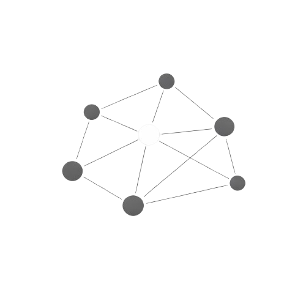

<p align="center">
  
</p>

# Revelio

Revelio is an interactive RAG explorer that makes retrieval visible.

Instead of treating semantic search and prompt assembly as a black box, Revelio lets you inspect the full flow: browse an embedding space in 3D, run retrieval against real corpora, inspect the exact context sent to the model, and watch the answer stream back.

It is useful for:

- learning how embeddings and retrieval actually behave
- demoing RAG to a team or client without hand-waving
- comparing retrieval strategies like cosine similarity vs. MMR
- indexing your own docs and exploring them with the same UI

## Product Overview

Revelio combines three things in one experience:

- **A 3D embedding map** that helps you see how semantically related chunks cluster
- **A retrieval workbench** for queries, chunk ranking, similarity thresholds, and retrieval mode comparison
- **A grounded answer view** that shows the exact prompt context behind each model response

Built-in corpora are already checked into the repo, so you can run the app immediately without generating data first.

## What You Can Do

- Explore built-in corpora for `Alice in Wonderland`, `FastAPI Docs`, `Space Exploration`, and `Word Embeddings`
- Switch between cosine similarity and MMR retrieval
- Adjust top-K retrieval and inspect the retrieved passages
- Compare word neighborhoods in the dedicated word-embedding corpus
- Use any OpenAI-compatible model endpoint for answer generation
- Index your own local documents and load them into the UI as custom projects

## Quick Start

### 1. Configure an LLM

Copy the example env file and point it at any OpenAI-compatible `/v1/chat/completions` endpoint:

```bash
cd ui
cp .env.example .env.local
```

Example providers:

```bash
# OpenRouter
LLM_BASE_URL=https://openrouter.ai/api/v1
LLM_MODEL=mistralai/mistral-small-3.1-24b-instruct:free
LLM_API_KEY=your_key
```

```bash
# Ollama or LM Studio
LLM_BASE_URL=http://localhost:11434/v1
LLM_MODEL=gemma2:9b
LLM_API_KEY=ollama
```

You can also override the endpoint and model from the settings menu in the app.

### 2. Run the UI

```bash
cd ui
npm install
npm run dev
```

Open [http://localhost:3000](http://localhost:3000), then go to `/demo`.

## Bring Your Own Documents

Revelio includes a CLI for turning a local folder into a custom corpus that shows up in the app.

```bash
cd cli
python -m venv .venv
source .venv/bin/activate
pip install -r requirements.txt

python revelio.py index ./path/to/docs --name "My Project"
```

What the command does:

1. Extracts text from supported files recursively
2. Chunks and embeds the extracted text
3. Projects the embeddings into 3D with UMAP
4. Writes a corpus JSON file to `ui/public/data/custom/`
5. Updates `ui/public/data/custom/manifest.json`

Supported file types:

- `.txt`
- `.md`
- `.pdf`
- `.jpg`
- `.jpeg`
- `.png`
- `.gif`
- `.webp`

Notes:

- PDF extraction uses `pypdf`
- OCR uses `pytesseract` and `Pillow`
- OCR also requires the `tesseract` system binary, for example `brew install tesseract`

After indexing, restart `npm run dev` if the app is already running.

## Regenerate Built-In Corpora

You only need this if you want to refresh the checked-in demo data or change embedding models.

```bash
cd cli
python -m venv .venv
source .venv/bin/activate
pip install -r requirements.txt

# generate every built-in corpus
python -m demo --all

# or generate one corpus
python -m demo --corpus alice
```

Generated files are written to `ui/public/data/{corpus}.json`.

Default models:

- Text corpora: `all-MiniLM-L6-v2`
- Word corpus: `BAAI/bge-base-en-v1.5`

## How It Works

At a high level, Revelio follows this pipeline:

1. Source text is chunked and embedded
2. Embeddings are projected into 3D for visualization
3. Queries are embedded client-side and matched against the full embedding vectors
4. Retrieved chunks are assembled into a RAG prompt
5. The answer is streamed from an OpenAI-compatible model endpoint

Important detail: retrieval does **not** use the 3D coordinates. The 3D map is only a visualization of the higher-dimensional embedding space.

## Built-In Corpora

| ID | Label | Best for |
|---|---|---|
| `alice` | Alice in Wonderland | narrative retrieval and quote-grounded answers |
| `fastapi` | FastAPI Docs | documentation-style semantic search |
| `space` | Space Exploration | broad factual topics with varied density |
| `words` | Word Embeddings | nearest-neighbor exploration without document QA |

## Repo Structure

```text
revelio/
├── cli/        # corpus generation and custom indexing
├── data/       # raw source texts and predefined queries
└── ui/         # Next.js app, 3D visualization, chat, settings
```

## Tech Stack

- Next.js, React, TypeScript, Tailwind CSS
- Three.js with React Three Fiber
- sentence-transformers for embedding generation
- UMAP for 3D projection
- OpenAI-compatible chat backends for answer generation
- Client-side cosine similarity and MMR retrieval
